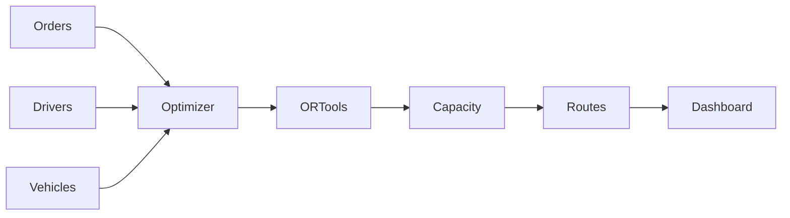
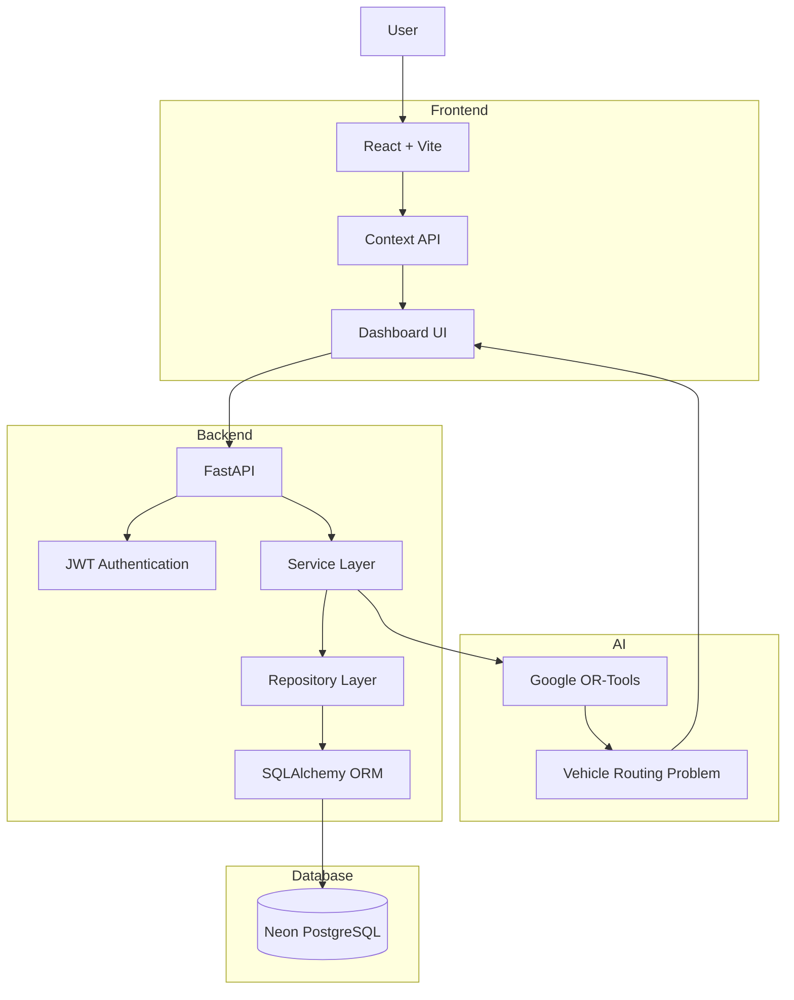
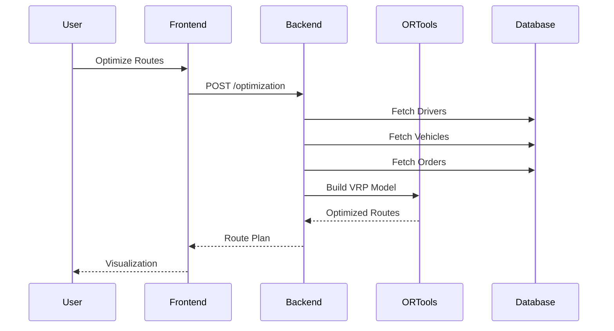

# 🚚 AI Logistics Route Optimizer

<p align="center">


</p>

An **AI-powered Smart Logistics Management Platform** that optimizes delivery routes using **Google OR-Tools Vehicle Routing Problem (VRP)** algorithms while providing a complete logistics management dashboard for drivers, vehicles, orders, analytics, and dispatch operations.

---

# 🌐 Live Demo

### 🚀 Frontend

**https://ai-logistics-umber.vercel.app**

### ⚡ Backend API

**https://ai-logistics-backend-zn50.onrender.com**

### 📚 API Documentation

**https://ai-logistics-backend-zn50.onrender.com/docs**

---

# ✨ Features

## Authentication

- JWT Authentication
- Secure Password Hashing
- Role-based Access
- Protected Routes

---

## Driver Management

- Create Drivers
- Assign Users
- Vehicle Assignment
- Driver Availability
- Capacity Management

---

## Vehicle Management

- Vehicle CRUD
- Capacity Tracking
- Active Status
- Availability Management

---

## Order Management

- Pickup & Delivery Locations
- Priority Levels
- Driver Assignment
- Vehicle Assignment
- Order Status Tracking

---

## AI Route Optimization

Powered by **Google OR-Tools**

- Vehicle Routing Problem (VRP)
- Capacity Constraints
- Multi-Vehicle Routing
- Route Distance Optimization
- Driver Assignment
- Estimated Delivery Routes

---

## Analytics Dashboard

- KPI Cards
- Driver Statistics
- Vehicle Statistics
- Order Analytics
- Interactive Charts

---

## Modern UI

- Responsive Design
- Dark Theme
- Search
- Pagination
- Loading States
- Validation
- Reusable Components

---

## 🧠 AI Route Optimization



## 🏗️ System Architecture




# 📁 Project Structure

```
AI-Logistics
│
├── backend
│   ├── app
│   │   ├── api
│   │   ├── core
│   │   ├── db
│   │   ├── dependencies
│   │   ├── models
│   │   ├── repositories
│   │   ├── schemas
│   │   ├── services
│   │   └── main.py
│   │
│   └── requirements.txt
│
├── frontend
│   ├── src
│   │   ├── components
│   │   ├── context
│   │   ├── pages
│   │   ├── services
│   │   └── App.jsx
│
├── alembic
├── Dockerfile
├── docker-compose.yml
└── README.md
```

---

# ⚙ Tech Stack

## Frontend

- React
- Vite
- React Router
- Axios
- Context API
- Recharts

---

## Backend

- FastAPI
- SQLAlchemy 2.0
- Alembic
- JWT Authentication
- Passlib
- Pydantic v2

---

## Database

- PostgreSQL
- Neon Database

---

## AI

- Google OR-Tools
- Vehicle Routing Problem (VRP)

---

## Deployment

- Vercel
- Render
- Docker

---

# 🚀 Optimization Pipeline



---

# 🔐 Authentication Flow


---

# 📊 API Modules

| Module | Description |
|---------|-------------|
| Authentication | Login & Registration |
| Users | User Management |
| Drivers | Driver CRUD |
| Vehicles | Vehicle CRUD |
| Orders | Order CRUD |
| Optimization | AI Route Optimization |
| Analytics | Dashboard Metrics |

---

# 📦 Local Installation

Clone the repository

```bash
git clone https://github.com/MainakDebnath6/AI-Logistics.git

cd AI-Logistics
```

Backend

```bash
python -m venv .venv

source .venv/bin/activate

pip install -r requirements.txt

alembic upgrade head

uvicorn backend.app.main:app --reload
```

Frontend

```bash
cd frontend

npm install

npm run dev
```

---

# 🌍 Environment Variables

Backend

```env
DATABASE_URL=
SECRET_KEY=
ALGORITHM=HS256
ACCESS_TOKEN_EXPIRE_MINUTES=30
BACKEND_CORS_ORIGINS=
```

Frontend

```env
VITE_API_BASE_URL=
```

---

# 📸 Screenshots

> Add screenshots here

- Login
- Dashboard
- Drivers
- Vehicles
- Orders
- Route Optimization
- Analytics

---

# 🎯 Future Improvements

- Live GPS Tracking
- Real-Time Dispatch
- Driver Mobile App
- ETA Prediction
- Fuel Consumption Prediction
- ML-Based Demand Forecasting
- Google Maps Integration
- Notifications
- Multi-Warehouse Optimization

---

# 👨‍💻 Author

**Mainak Debnath**

- GitHub: https://github.com/MainakDebnath6
- LinkedIn: https://www.linkedin.com/in/mainak-debnath01/

---

# ⭐ Support

If you found this project useful, consider giving it a ⭐ on GitHub!
